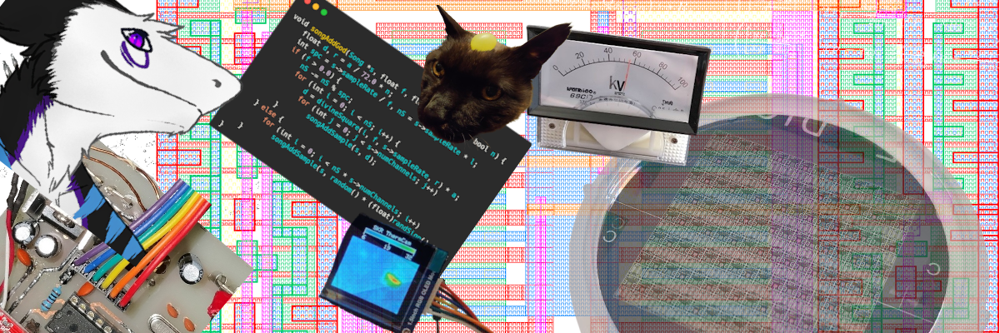

# Sceeker

I have **no** idea what I'm doing but I'm obsessed with obscure systems and clean ideas

---

## About Me

Hi, I’m Noé (aka Sceeker), engineer by training currently doing a PhD in "IC design".

Stuff I do *tries* to sits somewhere between formal engineering, experimental hacking, and a quiet acknowledgment of Wirth's law (oh boy do I sure love electron and alike shenanigans :ghost:).

- Working with **embedded systems** (FPGAs, MCUs)
- Developing **DIY experimental setups**, occasionally involving dangerous voltages and slightly suspicious hardware
- Strong bias towards **FOSS** things

Currently working on a bunch projects but keeping it low in case they end up never being finished :no_mouth:

---

## Stuff I enjoy

  
I said "enjoy"

  
  Never said I’m good at them.  
  (But hey, modesty doesn’t hurt, right?)
  

| Area               | Skills & Tools |
|--------------------|----------------|
| HDL                | SystemVerilog, VHDL |
| Embedded Software  | C, ASM (AVR) |
| Electronics        | Mixed signal & PCB design* |
| Software           | C, C++, Rust, Python |
| Other              | LaTeX, controlled sarcasm |

  **I know, I know, that both means nothing and everything*
